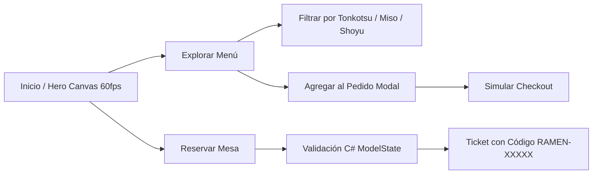

<div align="center">

# 🍜 Noodle Flow Ramen
### *Auténtico Sabor Tradicional Japones & Experiencia Web Interactiva a 60FPS*

[](https://dotnet.microsoft.com/)
[](https://learn.microsoft.com/aspnet/core/)
[](https://getbootstrap.com/)
[](https://developer.mozilla.org/)
[](https://developer.mozilla.org/en-US/docs/Web/API/Canvas_API)

<p align="center">
  <b>Una plataforma web moderna, elegante y reactiva para restaurantes de Ramen artesanal, construida con C# ASP.NET Core MVC y animaciones fluidas impulsadas por HTML5 Canvas.</b>
</p>

[Ver Características](#-características-principales) • [Arquitectura](#-arquitectura-del-proyecto) • [Instalación Rápida](#-guía-de-instalación-y-ejecución) • [Estructura](#-estructura-del-código)

---

</div>

## 🌟 Características Principales

### 🥢 1. Animación Interactiva HTML5 Canvas 60FPS
- **Renderizado por Hardware:** Motor en Vanilla JavaScript corriendo a **60fps estables** usando `requestAnimationFrame`.
- **Secuencia de Animación Estabilizada:** Ciclo de 39 fotogramas de alta definición de palillos levantando fideos desde el caldo con estabilización de coordenadas a nivel de sub-píxel.
- **Composición Multi-Bowl:** Composición simétrica con tazón principal centrado y tazones laterales con desfase de tiempo para una atmósfera inmersiva.
- **Efecto de Vapor Caliente:** Partículas y burbujas de vapor ascendente con física natural.

### 📜 2. Catálogo Dinámico de Menú en C#
- **Filtrado en Tiempo Real:** Categorización por *Tonkotsu*, *Miso*, *Shoyu*, *Entradas* y *Bebidas*.
- **Detalle de Ingredientes:** Indicadores de nivel de picante (🌶️), sellos de *Chef Special*, etiquetas vegetarianas (🌱) y desglose de ingredientes.
- **Servicio en Memoria:** Datos centralizados con inyección de dependencias (`IMenuService`).

### 🛒 3. Carrito y Simulación de Pedido
- **Persistencia Local:** Carrito interactivo respaldado con `localStorage`.
- **Modal Bootstrap 5:** Vista previa dinámica, ajuste de cantidades (+/-), cálculo instantáneo de subtotales y confirmación de orden.
- **Contador Dinámico:** Badge reactivo en tiempo real en la barra de navegación.

### 📅 4. Sistema de Reservas Online
- **Validaciones en Servidor y Cliente:** Validación estricta con `System.ComponentModel.DataAnnotations` (`[Required]`, `[Range]`, `[EmailAddress]`, `[Phone]`).
- **Ticket de Confirmación:** Generación de código único de reserva (`RAMEN-XXXXX`) con resumen de comensales, fecha y horario.

### 🎨 5. Diseño y Paleta Visual
- **Tema Oscuro Cálido:** Inspirado en las tabernas japonesas tradicionales (madera oscura `#120e0c`, caldo dorado `#f39c12` y acentos rojo ramen `#d9381e`).
- **Tipografía de Alto Contraste:** Textos en blanco puro y crema suave para una legibilidad 100% nítida.
- **100% Responsive:** Diseñado con enfoque *Mobile-First* para teléfonos, tablets y pantallas de escritorio.

---

## 🛠️ Stack Tecnológico

| Capa | Tecnología | Descripción |
| :--- | :--- | :--- |
| **Backend** | **C# / .NET 8** | ASP.NET Core MVC con Inyección de Dependencias |
| **Frontend UI** | **Bootstrap 5.3 + CSS3** | Componentes responsivos, Glassmorphism y Flexbox/Grid |
| **Animación** | **HTML5 Canvas + Vanilla JS** | Loop a 60fps con `requestAnimationFrame` y sprites PNG transparentes |
| **Iconos** | **FontAwesome 6** | Iconografía vectorial para platillos y controles |
| **Almacenamiento** | **In-Memory & LocalStorage** | Almacenamiento en memoria para demo + persistencia cliente |

---

## 📂 Estructura del Código

```text
noodle-flow-ramen/
├── Controllers/
│   ├── HomeController.cs          # Inicio, contacto y vistas principales
│   ├── MenuController.cs          # Catálogo dinámico y filtrado por categoría
│   └── ReservationController.cs   # Formulario y confirmación de reservas
├── Models/
│   ├── MenuItem.cs                # Entidad de platillos e ingredientes
│   ├── ReservationViewModel.cs    # Modelo de formulario con DataAnnotations
│   └── CartItemViewModel.cs       # Modelo de elementos de pedido
├── Services/
│   ├── IMenuService.cs            # Contrato del catálogo
│   ├── InMemoryMenuService.cs     # Implementación del menú con 13 platillos
│   ├── IReservationService.cs     # Contrato del sistema de reservas
│   └── InMemoryReservationService.cs # Almacenamiento y generación de códigos
├── Views/
│   ├── Home/
│   │   ├── Index.cshtml           # Hero Section con Canvas 60fps y destacados
│   │   └── Contact.cshtml         # Información del local y mapa interactivo
│   ├── Menu/
│   │   └── Index.cshtml           # Catálogo con filtros y agregado al carrito
│   ├── Reservation/
│   │   ├── Index.cshtml           # Formulario de reserva con validación
│   │   └── Confirmation.cshtml    # Ticket de reserva confirmada
│   └── Shared/
│       ├── _Layout.cshtml         # Layout global, Navbar, Carrito Modal y Footer
│       └── _ValidationScriptsPartial.cshtml
├── wwwroot/
│   ├── css/
│   │   └── ramen-theme.css        # Paleta oscura, fuentes de alto contraste y UI
│   ├── js/
│   │   ├── noodle-canvas.js       # Motor de animación Canvas a 60fps
│   │   └── cart.js                # Lógica del carrito de compras y modal
│   └── images/
│       └── ramen-frames/          # 39 fotogramas de animación estabilizados
├── Program.cs                     # Configuración del pipeline y servicios DI
└── noodle-flow-ramen.csproj       # Definición del proyecto .NET 8
```

---

## 🚀 Guía de Instalación y Ejecución

### Requisitos Previos
- **.NET 8.0 SDK** instalado en tu sistema ([Descargar .NET 8](https://dotnet.microsoft.com/download/dotnet/8.0)).
- Cualquier navegador moderno con soporte para Canvas (Chrome, Safari, Firefox, Edge).

### Paso a Paso

1. **Clonar el repositorio:**
   ```bash
   git clone https://github.com/kmoraga2003/noodle-flow-ramen.git
   cd noodle-flow-ramen
   ```

2. **Restaurar dependencias y compilar:**
   ```bash
   dotnet build
   ```

3. **Iniciar el servidor local:**
   ```bash
   dotnet run
   ```

4. **Abrir en el navegador:**
   Ingresa a: `http://localhost:5000` o la URL indicada en la consola.

---

## 🍵 Vista Previa de Funcionalidades



---

<div align="center">

Hecho con ❤️ y pasión por el **Ramen Artesanal** 🍜  
*Proyecto desarrollado con ASP.NET Core MVC & Bootstrap 5.*

</div>
